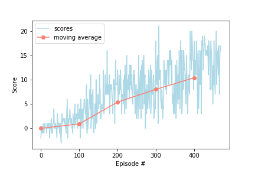

# Report

## Learning algorithm
 
The agent used for this reinforcement learning task was a simple implementation of the vanilla Deep Q-Network (DQN) algorithm. The DQN algorithm was first introduced in an [original paper](https://web.stanford.edu/class/psych209/Readings/MnihEtAlHassibis15NatureControlDeepRL.pdf) by Deep Mind with the purpose of fixing [known difficulties](http://citeseerx.ist.psu.edu/viewdoc/download?doi=10.1.1.73.3097&rep=rep1&type=pdf) related to the use of neural networks as function approximators of action-value functions.

The main innovations introduced in the DQN paper were 

    - Experience replay and
    - Fixed Q-targets,

which we briefly explain. Experience replay aims to break correlations between experience tuples that may lead the agent to ineffective policies. The idea is to store experience tuples in a buffer and then sample from the buffer at random to break the temporal correlations between experience tuples. The buffer is gradually updated as the agent interacts with the environment. Besides breaking harmful correlations between successive experience tuples, experience replay allows the agent to learn from valuable and rare experiences multiple times, which further enhances the learning process.

Just the same, fixed Q-targets aim to break another type of spurious correlation that arises from the fact that the temporal-difference target function (the Q-target) is being constantly updated as the parameters of the neural network are optimized by gradient descent. The solution is to decouple the parameters of the Q-target from those of the neural network: we fix the parameters of the Q-target during the learning step, thus providing a stable target to update the neural network. After some learning steps, the target is updated with the current parameters of the neural network and the process is repeated on an on.

We can think of similar situations that happen in human learning. A human agent that always performs the same actions and gets the same responses from her environment (thus never peeking out of her safety zone) is typically not going to react properly to new experiences and will likely expect that the same actions will always lead to good results. This situation is the human equivalent of not performing experience replay.

Similary, often in life we learn one step at a time.  In order to master a skill, we have to reach several intermediate landmarks that are not our end goal, but without which we would likely get lost in the learning process. This is analogous to the fixed Q-targets technique employed in the DQN algorithm. 

The neural network used here was a feed forward network with three fully connected hidden layers with dimensions (64, 32, 16). Thus from input to output the network has dimensions (37 = dimension of states, 64, 32, 16, 4 = dimension of actions). With the help from these two techniques from the DQN algorithm, it achieves great performance in this learning task.

### Hyperparameters 

    - Maximum steps per episode: 1000
    - Epsilon start: 1.0
    - Epsilon end: 0.01
    - Epsilon decay rate: 0.99
    - Learning rate: 0.001
    - Buffer size: 1e5
    - Batch size: 64
    - Gamma: 0.99 
    - Tau: 0.001
    - Update every: 4

## Plot of rewards

In the experiments performed, this architecture and choice of hyperparameters often achieved an average reward >= 13.0 over 100 episodes in less than 400 episodes. In the experiment shown, 370 episodes were enough. 

## Ideas for future work

Several improvements can be made to the vanilla DQN, including Prioritized Experience Replay and Dueling DQNs. A list of possible combinations that may lead to improvements is suggested in the [Rainbow paper](https://arxiv.org/abs/1710.02298). These improvements are expected to significantly impact performance, especially on the more challenging task of learning a good policy from raw pixels. 

